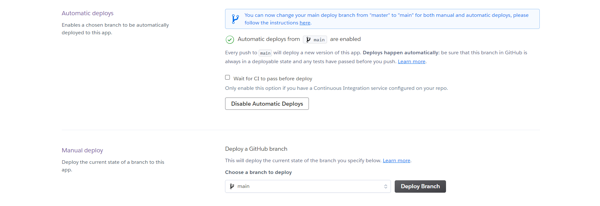
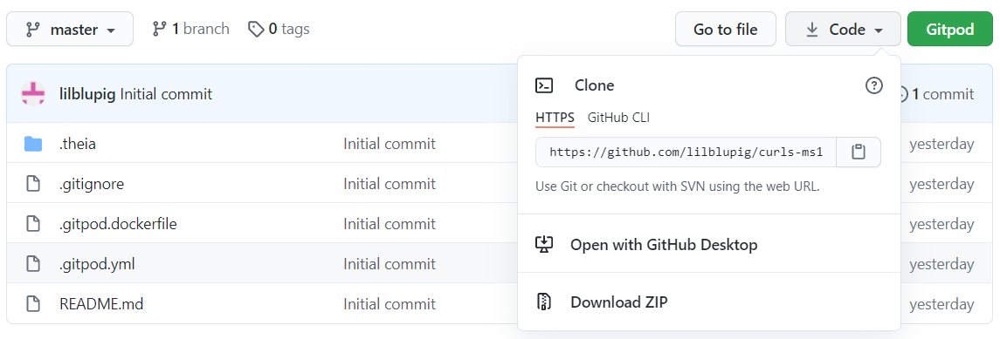

# **Imprint**

# Overview
This is a mobile first website designed to encourage tourists and locals alike to bask in the rich and varied history of a small town in Dorset called Shaftesbury.  An historic saxon hilltop town, Shaftesbury and it's inhabitants pride themselves on the extensive history of the town and surrounds.

Imprint takes a map of the town centre, and allows users to select an area, which will generate a gallery of images related to that part of the town.  These images will hopefully have been generated and uploaded by site users, providing a true community history of this incredible town.

# Index
1. [UX](#ux)
    * [User Stories](#user-stories)
    * [Strategy](#strategy)
    * [Scope](#scope)
    * [Structure](#structure)
    * [Skeleton](#skeleton)
    * [Surface](#surface)
1. [Features](#features)
    * [Existing Features](#existing-features)
    * [Features for Future Implementation](#features-for-future-implementation)
1. [Testing](#testing)
1. [Development Life Cycle](#development-life-cycle)
1. [Deployment of the Application](#deployment)
    * [Cloning via GitPod](#cloning-a-project-into-gitpod)
    * [Cloning Locally](#how-to-run-the-code-locally)
1. [Technologies Used](#technologies-used)
1. [Credits](#credits)
    * [Website](#website-credits)
    * [README](#readme-credits)

Note, testing information can be found in a separate document:
* [Testing](TESTING.md)

## UX

### **Overview and Broad Design Choices**
The website should be immediately useable from very first navigation with an unobtrusive interface, and the focus on the images from start to finish.

Fonts and colours are chosen to be striking but unfussy, and assist with intuitive navigation and use of the site.

The whole point is to become lost in nostalgia and wonder at how much has changed, yet how much has stayed the same.

### **User Stories**
There are three types of anticipated user:
1. Tourists/visitors
1. Locals
1. Local business owners

For these groups the following needs are identified:
1. As a new tourist user, I want to link what I can see to what has been - clearly and easily.
1. As a new local user, I want to find images of places I know.
1. As a new business user, I want to be able to find the area which relates to my business.
1. As a returning tourist user, I want to upload my own photographs, and easily find them to relive my memories.
1. As a returning local user, I want to share images and memories of my past and feel part of a community.
1. As a returning business user I want to be able to add value to the profile of my business and attract custom.

These stories are addressed fully in the [Testing](TESTING.md) document.

### **Strategy**
Who is the website for?  
The website is for people who want to celebrate the past and link it to the present.  More specifically, it is aimed at providing an alternate view of the town in all its changing glory.

What does the owner of the website need/want?  
The website owner wants to help grow interest in the town, the businesses it has grown and the people it serves.

What do the users of the website need/want?  
The users of the website want to utilise the history of the town to enhance their experience of it, though in a number of different ways.

Broadly, how does the website meet these needs?  
The website focuses on historic imagery of the town as uploaded by the users into location specific categories.  This meets the needs of the owner by promoting curiosity about the town and its past, and of the users by providing them with evocative pictures to compliment their visit or experience, and to help build the brand of a business.

Owner aims:
* Add a new dimension to local tourism
* Bring attention to local businesses
* Attract back the interest of locals

User aims:
* Learn about surroundings
* Share experiences and memories
* Promote business

### **Scope**
The website exists to encourage tourism and active discovery of local history.  Nostalgia and enjoyment are the primary aims.

#### Feature Viability

| # | Feature | Importance | Viability | Comment |
|---| ------- | :--------: | :-------: | ------- |
1.| Clickable map which loads images  | 5 | 4 | Y - Whole purpose of site
2.| Users create and manage profiles | 5 | 5 | Y - Needed for community aspect
3.| Users can add and manage images  | 5 | 5 | Y - Community contributions will add value
4.| Display content relative to signed in user  | 5 | 5 | Y - Allows user to manage contributions
5.| Designed strcitly mobile first | 5 | 5 | Y - Most likely device to be used to access site by far
6.| Comments section for images | 4 | 2 | N - Unsure how this would work with non-relational database
7.| Have form/user group for businesses | 2 | 2 | N - Not required for site function, but would be nice in future
T.| Total score | 31 | 28 |

#### Feature Plan
First increment:
* Interactive map
* User profiles
* Users can upload images
* Display relevant content for user
* Mobile first design

Second increment:
* Drill down to individual image and view image info as uploaded
* Filter returned images

Third increment:
* Business accounts
* Comments
* Use Google maps to show user location on map

### **Structure**
* See Information Grouping [mind map here](readme-files/documents/structure.pdf).

### **Skeleton**
In line with structure planning.

#### Wireframes

##### Original
1. [Mobile](readme-files/documents/imprint-mobile.pdf) 375px
1. [Tablet](readme-files/documents/imprint-tablet.pdf) 768px
1. [PC/Laptop](readme-files/documents/imprint-pc.pdf) 1200px

##### Final
1. [Mobile](readme-files/documents/imprint-mobile-final.pdf) 375px
1. [Tablet](readme-files/documents/imprint-tablet-final.pdf) 768px
1. [PC/Laptop](readme-files/documents/imprint-pc-final.pdf) 1200px

##### Summary of Changes
* 

### **Surface**

#### Colours
The colours used for the site are based on the colours which comprise the historic Shaftesbury coat of arms.  These are primarily blue and white, with yellow highlights.  A deep red was chosen as a second complimentary colour, and is the colour used by the Town Council.

The colours were tested on [Coolors](https://coolors.co/) to ensure that a colourblind user would be able to differentiate between all colours, and that the colours remained visually pleasing.

#### Typography
The fonts for the site were chosen for a clean but striking aesthetic.  Appropriate letter and word spacing for dyslexic users was researched and [Google fonts](https://fonts.google.com/) scanned for eye catching examples, which were then checked against researched criteria from the British Dyslexia Association.

Cinzel was chosen for headings because of its historic feel, but relative lack of accents.

Nunito will be used for the body font, providing a clean open feel.  It is likely that one of the lighter weights will be used once seen in the working environment.

## Features

### **Existing Features**
Features common to all pages/sections:

#### XXXXX

### **Features for Future Implementation**
1. What | Why

## Testing

This information is held in the [Testing](TESTING.md) file.

## Development Life Cycle

This section is to provide an brief insight into how the approach to the code structure of the website was expected to work, what changed and why, and then to summarise how the creator would now approach replicating the project.

Changes to design are documented in the [UX section](#ux) under [wireframes](#wireframes).

The project was deployed using GitHub pages once the basic structure of the page was complete.  This allowed for continuous delivery as each change was made, and pushed and enabled testing of the page during development on different devices.

Commits were made as each section of each page was added and pushed once a section was complete.

### **Reflections on General Approach to Build**
What would be done differently next time?  What went right?  Overall opinion.

### **Lessons Learned**

#### Preparation

#### Build

### **Revised Development Process**

Based on the experience of producing the website, the creator would now take the following approach.

#### Preparation

#### Build

## Deployment

The website was created using [GitPod](https://www.gitpod.io/). Version control was undertaken by committing to [Git](https://git-scm.com/) and pushing to [GitHub](https://github.com/) using the functions within GitPod.  [Heroku]((https://heroku.com/)) was used to deploy the live site.

### **Deployment of the Page**
Continuous deployment via GitHub-Heroku link was utilised for this project.  As such, deployment was amongst the first tasks undertaken.
1. In the IDE, ensure that a small test application exists, and all changes are committed and pushed to GitHub.
1. Create a requirements file, which will be used by Heroku in creation of the deployment.
    * In the terminal, type "pip3 freeze --local > requirements.txt".
    * Commit this to Git.
1. Create a Procfile, which is used by Heroku to determine the language for the app.
    * In the terminal, type "echo web: python app.py > Procfile".
    * This is case sensitive, and should have a capital P, and should have no file extension.
    * Commit this to Git.
1. Push these files to GitHub.
1. [Sign in to Heroku](https://id.heroku.com/login) (or [create a Heroku account](https://signup.heroku.com/) if you do not already have one), and choose "New > Create New App".

1. Choose an app name, which must be unique, and select the nearest region.  Then click "Create App".

1. Once generated choose the "Deploy" tab, select "Connect to GitHub" sub-tab and click the "Connect to GitHub" button.

1. Follow the on-screen instructions to link Heroku to your GitHub account.
1. Click the "Settings" tab from the main menu, and scroll down to find "Reveal Config Vars".  This section should be populated with any sensitive data which is not appropriate to send to GitHub, usually in an "env.py" document.

1. Back on the Deploy tab, once linked, Heroku will prompt for the repository name, complete this and click "Search".

1. The repo listing should appear, click "Connect".
1. Heroku will process the request before showing that the connection has been made successfully, and showing two new options.  Click the first of these, which is to "Enable Automatic Deploys".

1. The second option is to "Deploy Branch".  Click the button and Heroku will process for some time.

1. Once complete, Heroku will display a checklist, followed by a "View" button.  Click this to open the app in a new tab.

1. Celebrate! Your app should now update in line with any changes pushed to GitHub.

### **How to Clone and Run the Code Locally**
There are slightly different approaches should you choose to use GitPod to clone the project, or a local IDE.

#### Cloning a Project into GitPod
1. Use [Google Chrome](https://www.google.com/intl/en_uk/chrome/). *(This can also be undertaken in Firefox)*
1. If you do not already have one, [create a GitHub account](https://github.com/join).
1. Install the [GitPod browser extension for Chrome](https://chrome.google.com/webstore/detail/gitpod-dev-environments-i/dodmmooeoklaejobgleioelladacbeki). *(Or Firefox if appropriate)*
1. Restart Chrome.
1. In GitHub, find the [project repository](https://github.com/ci-14-task-manager).
1. From the repository menu, choose the green GitPod button.

1. A new GitPod workspace will open containing the project code.

#### Cloning a Project into a Local IDE
1. Navigate to the [GitHub Repository](https://github.com/ci-14-task-manager).
1. Choose the Code dropdown menu, and copy the URL.

1. Open your local IDE and then open a terminal.
1. Set the current working directory to your preferred location for the cloned project.
1. Type in "git clone " followed by the copied URL. Be sure to include a space between git clone and the url, then press enter.
1. The cloned project will be created.

You can find more information on cloning a repository from GitHub [here](https://docs.github.com/en/github/creating-cloning-and-archiving-repositories/cloning-a-repository).

## Technologies Used

### **Languages**
* HTML5 is used to provide the basic structure of the website.
  * About: [HTML5 Wiki](https://en.wikipedia.org/wiki/HTML5)
  * Creator: [W3 Consortium](https://www.w3.org/)
* CSS3 is used to provide most of the styling for the website.
  * About: [CSS3 Wiki](https://en.wikipedia.org/wiki/CSS)
  * Creator: [W3 Consortium](https://www.w3.org/)
* JavaScript is used to provide the interactive nature of such components throughout the website.
  * About: [JavaScript Home](https://www.javascript.com/)

### **Libraries and Frameworks**
* [Materialize CSS](https://materializecss.com/getting-started.html) is used to provide further styling and structure.
* [jQuery](https://jquery.com/) is used to simplify the implementation of interactive JavaScript components.
* [Flask]() is used to provide a structure the Python application, and make use of the Jinja templating language.
* [Flask Pymongo]() was used to allow Flask to communicate with MongoDB.
* [DNS Python]() was installed in order to use the Mongo SRV connection string.
* [Flask_WTF](https://flask-wtf.readthedocs.io/en/1.0.x/) is used to provide form structure, functionality and data validation.
* [Werkzeug](https://werkzeug.palletsprojects.com/en/2.0.x/) is used to provide user security around passwords and storage.
* [Google Fonts](https://fonts.google.com/) are used to provide the typography for the website.
* [Font Awesome](https://fontawesome.com/) is used to provide the icons for the website.
* [Google ReCaptcha](https://www.google.com/recaptcha/) is used to protect the contact and sign up forms.

### **Tools**
* [Git](https://git-scm.com/)/[GitHub](https://github.com/) was used for version control and repository storage.
* [GitPod](https://www.gitpod.io/) was the IDE used to write the project.
* [Chrome Dev Tools](https://developers.google.com/web/tools/chrome-devtools) were used for specific responsiveness testing and drilling down into bug fixing.
* [Lighthouse](https://developers.google.com/web/tools/lighthouse) was used for macro testing and identification of errors for rectification.
* [W3C CSS Validation Service](https://jigsaw.w3.org/css-validator/) was used to remove any remaining errors in CSS code.
* [W3C HTML Validation Service](https://validator.w3.org/) was used to remove any remaining errors in HTML code.
* [JS Hint Validation Service](https://jshint.com/) was used to check for major errors in JavaScript.
* [Responsively](https://responsively.app/) was used to explore responsiveness across various devices.
* [RandomKeyGen](https://randomkeygen.com/) was used to produce the database Secret Key, amongst other security.
* [Flaticon](https://www.flaticon.com/) was used to make the favicon.

### **Other Resources**
* [Code Institute Full Template](https://github.com/Code-Institute-Org/gitpod-full-template) was used to set up the repository.

## Credits

### **Website Credits**
The following resources provided strong underlying understanding for items within the website, even where the approach has ended up being different.
* Forms - [Hackers & Slackers](https://hackersandslackers.com/flask-wtforms-forms/) tutorial.
* Recaptcha link up - [Easy ReCAPTCHA with Flask-WTF](https://john.soban.ski/add-recaptcha-to-your-flask-application.html) blog.

#### Content
Where did the website content come from?

#### Media
* The photographs used for the website were obtained from [Pexels.com](https://www.pexels.com/):

* The diagrams used for the website were obtained from various places:

#### Acknowledgements
Thank you in particular to:
* Reuben Ferrante for mentoring the project.

### **README Credits**

#### Content
Structure and content based heavily on:
* [Code Institute Solutions - README Template](https://github.com/Code-Institute-Solutions/readme-template)
* [Daisy McGirr - Code Institute Testing Webinar](https://us02web.zoom.us/rec/play/9FIKllHX2ZiQNFRhYPn_hBh_ZeA8964ZvIDLnhpKGAf1NLVc3_hBJ6zSL8Hv5Hx7ALnPtDmbg8CmFAs.YVsZ9LR_uI7OjEwH)

#### Media
The images for this README are from the following sources:
* Snips taken from GitHub.
* [Am I Responsive](http://ami.responsivedesign.is/).
* Wireframes created with [Balsamiq](https://balsamiq.com/).
* Colour mockups created with [Coolors](https://coolors.co/).
* Snips taken of Google Fonts.

#### Other
* Markdown basic taken from [Mastering Markdown](https://guides.github.com/features/mastering-markdown/).

**This website was produced as an educational project for the Code Institute Full Stack Development course.**

**Created by Amy Hacker.**

[Back to Top](#imprint)