# **Imprint**

# Testing

A plan and log for testing the website, this is a manual testing plan due to the limitations of the developer at this time, and the nature of the page.

# Index
1. [Validation Testing](#validation-testing)
1. [Logic Error Testing](#logic-error-testing)
1. [Client Stories Testing](#client-stories-testing)
1. [Manual Testing](#manual-testing)
    * [Common Elements](#common-elements)
    * [Page Specific Sections](#page-specific-sections)
    * [Accessibility](#accessibility)
1. [Bugs](#bugs)

## Validation Testing
The project code has been passed through the following code validators:
* [HTML Code Validator](https://validator.w3.org/) displays two of the same warning re sections with no header tags inside.  The first of these is the flash message container, and the second appears only for form pages where there are no further header tags included in the body.  These warnings are considered acceptable as the page layout should still be clear and understandable to users of screen readers.  All pages were checked.
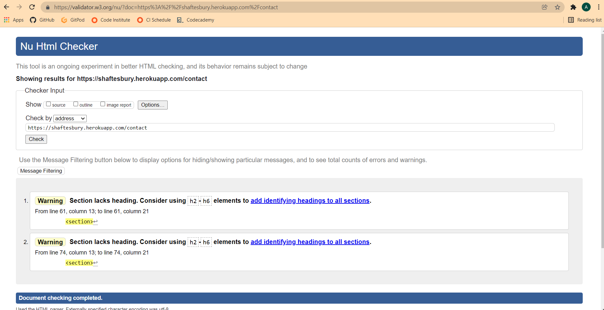

* [CSS Code Validator](https://jigsaw.w3.org/css-validator/) (one warning - external stylesheets are not checked)
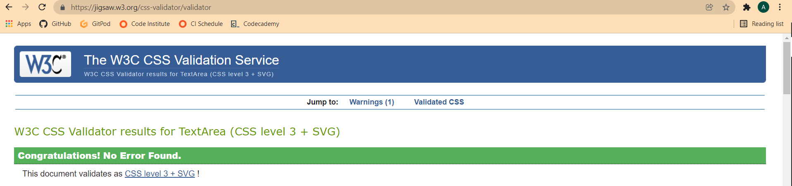
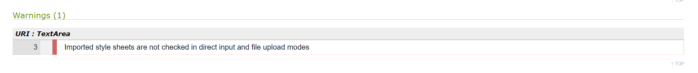

* [JS Hint](https://jshint.com/) was used to assess all three Javascript files.  All files return warnings that some code is not compatible prior to ES6, this is not considered an issue as the vast majority of modern browsers are ES6 compatible.  The file containing the maps polygons returns unused variable warnings, but these are used in the maps.js file, so this is not a problem.  The maps.js file shows the same undefined variables as are unused in the map_polygons.js file, and one note on the geolocation error handler.  This is not considered a problem as the code works as expected if the user allows location tracking and the location cannot be retrieved.  The script.js file assessment returns only warnings about $ signs which are used by jQuery.

* The project has been assessed throughout development using [Lighthouse](https://developers.google.com/web/tools/lighthouse).
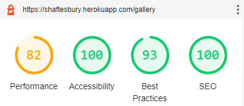
  *  As an image heavy website running on Heroku free dynos, Imprint was not expected to do well on performance, so the score 82 is definitely acceptable.  This could potentially be improved in future by setting up 'on the fly' image transitions from Cloudinary to use much smaller images on the Gallery page, but still return high quality images for single image view.
  *  The best practice issues are not having a robust enough Content Security Policy, and asking for location on page load.  Ideally in the future location request will take place when the Map accordion is expanded for the first time instead, but time constraints prevent this at this moment.  A technically solid CSP is not in place as they generally restrict any interactive or styling nature of a website. Since this website is designed to entertain it is necessary to keep those elements in place.  There may be scope to tighten up protection against Cross Site Scripting in future using Talisman, or some other security extension.

## Logic Error Testing
1. Relates mainly to forms and gallery page.  All forms were tested for validation and appropriate user feedback.

1. All website functionality which requires adding to/changing/deleting from the database was checked, ensuring that all expected database changes took place accordingly.

1. Logic is also used for the majority of the security on the site, the main risk was noted as brute force access to restricted or personal areas via direct entry of the appropriate url.  Ob such pages the website checks for a session cookie and tests the values held within before determining whether to allow the user to view that page.  All restricted and personalised areas were tested both logged out and logged in as a different user to ensure that the appropriate action was taken by the website.  Initially the admin pages threw an error but this was due to the route trying to remove a cookie that did not exist.  This issue has been resolved.

## User Stories Testing
1. As a new tourist user, I want to link what I can see to what has been uploaded - clearly and easily. 
    1. The location filter adds a polygon of the rough area the pictures were taken in to a Google map - the user should easily be able to identify landmarks.
    1. In addition to this, if the user allows location tracking, a pin is added to the map which shows their location.  The polygon and marker will both display at the same time.
    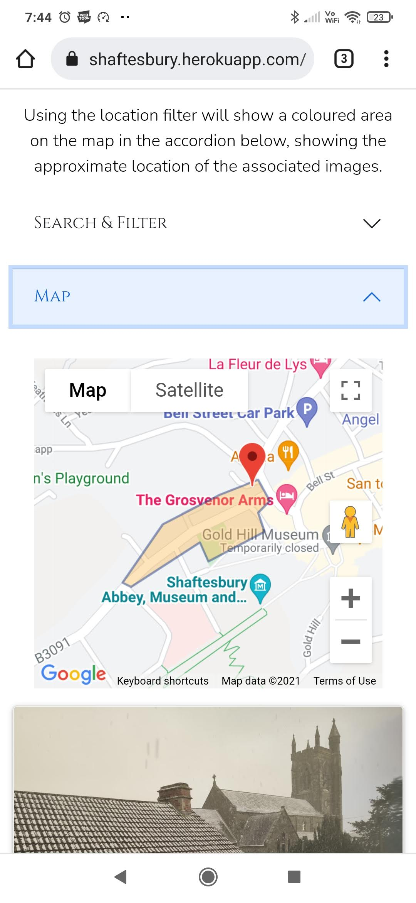
1. As a new local user, I want to find images of places I know. 
    1. The free text search allows users to search for terms in the location, details and tags fields.  If someone has uploaded a photo of the cenotaph, the Kings Arms or the Trinity centre they should be easily found so long as they are tagged correctly.
    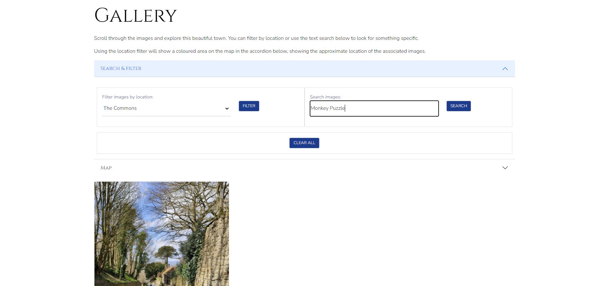
1. As a new business user, I want to be able to find the area which relates to my business.
    1. A business user will know roughly which bit of town their business is in.  They can location filter as above, or search for tags relating to their business, address or previous property holders.
    1. In the example below, the haberdasher Hine & Parson is shown in both photographs.
    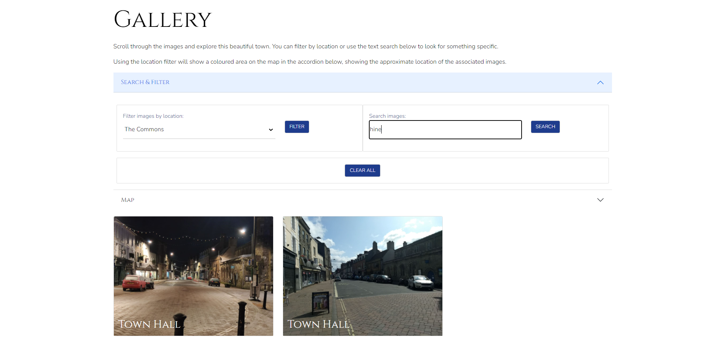
1. As a returning tourist user, I want to upload my own photographs, and easily find them to relive my memories.
    1. Registering for an account is simple, and the image upload form is designed to be as easy as possible.  The upload function works on computers and mobile devices.
    1. Once registered, there is a profile area which is easy to find and shows all images uploaded by the logged in user.
    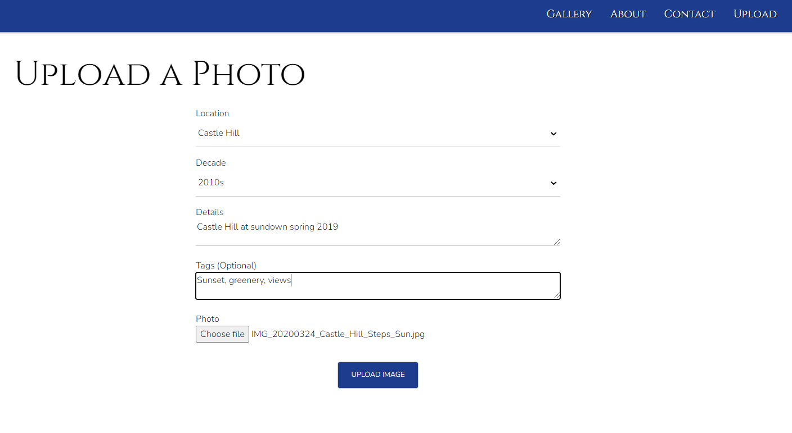
1. As a returning local user, I want to share images and memories of my past and feel part of a community. 
    1. When uploading, it is possible to select a decade in which it is estimated the picture was taken.  This can be searched, so it should be easy to share memories, and find those of others.
    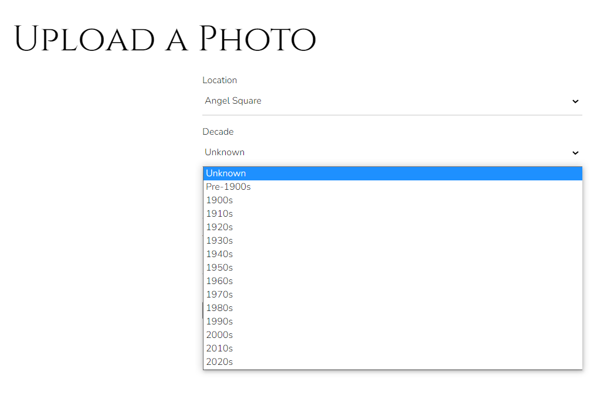
1. As a returning business user I want to be able to add value to the profile of my business and attract custom.
    1. Shaftesbury locals love history, it is just a part of who we are.  By finding, uploading and sharing one or more images of their business premises as it was they should be able to start a conversation around their work and attract people to come and see.  In future, comment threads should help promote this.
    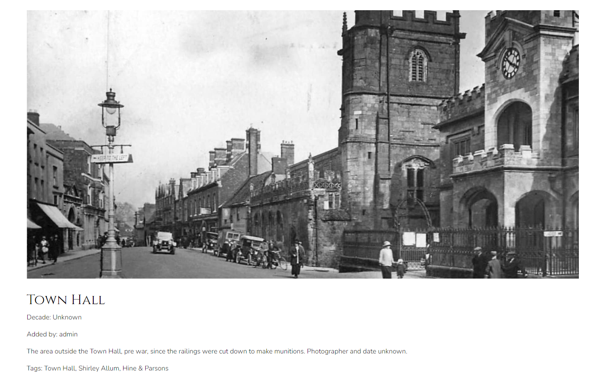

## Manual Testing

### **Common Elements**

These components are present on every page, and each page has been tested.  Testing for this document took place on
* Windows laptop using Chrome, Edge and Firefox
* Xiaomi Mi9 Android mobile
* Tesco Hudl2 Android tablet

Other devices were used to view the page throughout development, including Nexus 10 tablet, Motorola E7 power and Google Pixel XL.

A [spreadsheet](readme-files/documents/testing.xlsx) is included which provides more granular detail on the testing undertaken.

---

#### Navigation Bar

**Intent** - a navbar which collapses to hamburger on tablet and mobile.

* All links are valid and link to the appropriate page.
* Hover effect occurs correctly for each navigation section.
* Resize to mobile/tablet and check that navigation bar collapses to hamburger.
* Expand hamburger menu and check all sections present, and displaying correctly.

**Result** Initially collapse to hamburger at small meant that the nav looped onto two rows on a tablet when expanded.  This was changed such that the hamburger menu remains present until the transition to large viewport.

**Verdict** - PASS

---

#### Footer

**Intent** - The footer should be reflective of the design of the nav to bookend each page and provide familiarity to the user.  This helps with intuitive learning.  Any links should provide user feedback when hovered over.

* Footer appears in 3 sections on large and above, and two sections on medium and below.
* Resize to tablet and check for text overflow issues.
* Resize to mobile and check that sections wrap neatly below one another.

**Result** - All behaviour as expected

**Verdict** - PASS

---

### **Page Specific Sections**

These items are specific to each individual page.

#### Basic Plan for Body Sections
* Check all areas of text align appropriately, horizontally and vertically.
* Check that behaviour is correct for mobile/tablet.
* Check that any links, buttons or fields show feedback behaviour on hover.
* Check that any links navigate to correct pages.
* Check that any external links open in a new tab, to the correct place.
* Check that any icons do not overflow into text on mobile/tablet.

---

#### Gallery and images

**Intent**

Gallery page should display two accordion sections for searches and a map above tiles in columns appropriate for the size of the device in use.

Single image displays a full width image cropped according to device size.  Primary purpose, to elicit a positive emotional response from the user.  The image should display correctly on all device sizes.

* Accordions fit page width according to device and content within resizes accordingly.
* Tiles display 3 wide on large, two on tablet and one on mobile.
* Single image fills the viewport width as expected depending on page.
* Resize to mobile/tablet and check that image still displays without distortion.
* Text remains centered/justified with no overflow at mobile/tablet.

**Result** - Edit image page had significant image overspill on mobile and tablet.  This has been corrected.

**Verdict** - PASS

---

#### Forms

**Intent** - Allow the user to get in touch with the owners, login/register for use and make it as easy as possible to do so.

* All text sections/fields display correctly across tested device widths.
* All form fields validate content (or lack thereof) and feedback to the user.
* Edit image form prefills with previously submitted content.
* Fields and submit button display feedback on hover.
* Fields display feedback on focus.
* Try to submit blank form, error messages display with information.
* Try to submit email in incorrect format, error message displays with information.
* Try to submit form without question, error message displays with information.
* Submit correctly completed form, receive success modal.

**Result** - Flash messages specific to forms was appearing correctly by the appropriate field but was plain black text.  This was updated to use the same styling as the main flash message container.

**Verdict** - PASS

---
#### 404, 500 and general error handling

**Intent** -

* Catch users who would normally encounter a browser generated 404 page, and redirect them back to the website as cleanly as possible.
* Display a simple error page in the instance of 500 or other error which redirects user back to website.
* Specific try-catch error handling for email contact form which feeds back on success failure to the user.

* Mistyped url for website to ensure 404 page displays in such situations.
* Deliberately broke page link to ensure 404 page will display in this instance too.
* Generic error message page displayed on keyerror discovered by admin security testing (now fixed).
* Email feedback tested by changing Gmail app password in Heroku such that Gmail would not recognise the site.  Message displayed correctly.

**Result** - All error types tested produced the expected pages and messages for the user.

**Verdict** - PASS

---

### **Accessibility**

The colourblind feature on Coolors was used to check that the colours appeared sufficiently different, and not jarring for these users.
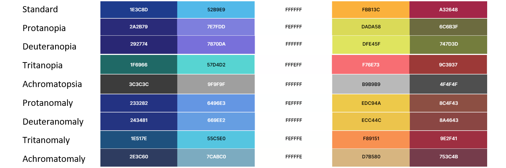

As well as the use of the Lighthouse assessments of accessibility, the website was browsed at intervals by two users who may experience difficulty.  A dyslexic user with ASD and a colourblind user both explored the website during deployment.

## Bugs

Details of any persistent or difficult bugs, and any bugs which remain unresolved.

### **Fixed Bugs**
After code refactor logged in users sporadically unable to access upload or profile pages.  It was initially suspected that cookie/database read write had been affected and significant time was invested into fixing the issue.  Eventually it transpired that a ".lower()" had been removed from username processing to cookie on login route. As such, the username that was stored in the session cookie would take on whatever case was entered in the login form, where the value checked against the database was forced to lowercase correctly.

### **Remaining Bugs**
The Google Map displays inconsistently in the deployed environment and no pattern or common cause can be established.  The map appears and displays correctly approximately 78% of the time when tested, which is far lower than desired.  Refreshing the page generally loads the map as expected.  The map works as expected 100% of the time in the development environment.  The value that the map adds to the experience of using the website, particularly for visitors is considered great enough, and the workaround of refreshing is low impact enough that the map has been included in the final deployed version.

Testing first completed 27/12/2021 - AKH
Testing repeated 02/01/2021 - AKH

[Return to Top](#title)